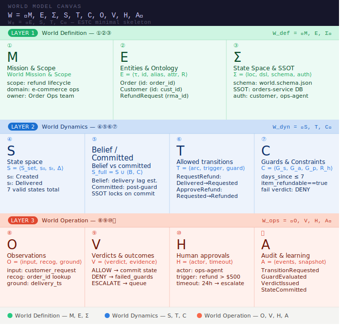
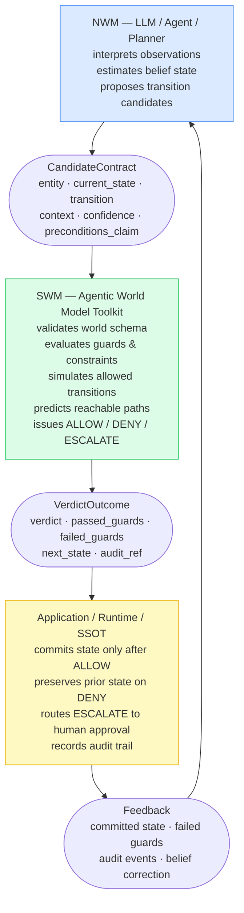

# Agentic World Model

**Define executable business worlds for production AI agents.**

> This is not another agent framework. It is a world specification layer for agentic execution.

[](https://github.com/swit001/agentic-world-model/actions/workflows/ci.yml)
[](LICENSE)
[](https://www.typescriptlang.org/)

---

## What is this?

LLM agents are powerful at reasoning — but they hallucinate states, skip constraints, and bypass approval gates. **Agentic World Model** gives every agent a symbolic world to operate inside: entities with valid states, transitions with guards, verdicts, and audit trails.

**Neural agents interpret observations and propose actions.**
**Symbolic world models validate states, transitions, constraints, verdicts, and audit trails.**

### Core principle

```
Agents propose.
Worlds validate.
Systems commit.
```

---

## The Model

### ESTC — the minimal world atom

```
ESTC = Entity + State + Transition + Constraint
```

### Full world definition

```
W = <M, E, Σ, S, T, C, O, V, H, A>
```

| Symbol | Meaning |
|--------|---------|
| M | Mission and scope |
| E | Entities and ontology |
| Σ | State space and SSOT schema |
| S | Current states in the SSOT |
| T | Transitions |
| C | Constraints and policies |
| O | Observations and grounding |
| V | Verdicts and outcome contracts |
| H | Human approvals and escalation |
| A | Audit trail and learning history |

---

## World Model Canvas



View the canvas: [World Model Canvas HTML](assets/world_model_canvas_en.html)

The canvas shows how ESTC expands into the full enterprise world structure: definition, dynamics, and operation.

## Architecture

Agentic World Model is the symbolic side of a neuro-symbolic runtime. The neural layer interprets observations, estimates belief, and proposes transition candidates. The symbolic layer adjudicates whether those candidates are executable under the declared world.



---

## Install

Use the CLI without installation:

```bash
npx @agentic-world-model/cli@latest validate examples/commerce/refund.world.yaml
```

Or install the CLI globally:

```bash
npm install -g @agentic-world-model/cli
awm validate examples/commerce/refund.world.yaml
```

Or install the core SDK as a library:

```bash
npm i @agentic-world-model/core
```

---

## Quickstart

Try it in 30 seconds, no clone required:

```bash
npx @agentic-world-model/cli@latest simulate examples/commerce/refund.world.yaml RequestRefund \
  --entity Order --state Delivered \
  --context days_since_delivery=5,item_refundable=true
```

Requires Node.js 18+ and pnpm.

```bash
# 0. Clone
git clone https://github.com/swit001/agentic-world-model.git
cd agentic-world-model

# 1. Install
pnpm install

# 2. Build
pnpm build

# 3. Validate a world
pnpm awm validate examples/commerce/refund.world.yaml

# 4. Simulate an allowed transition
pnpm awm simulate examples/commerce/refund.world.yaml RequestRefund \
  --entity Order --state Delivered \
  --context days_since_delivery=5,item_refundable=true

# 5. Simulate a denied transition
pnpm awm simulate examples/commerce/refund.world.yaml RequestRefund \
  --entity Order --state Delivered \
  --context days_since_delivery=14,item_refundable=true
```

---

## Examples

### Commerce: Refund (Hello World)

A minimal example — one entity, four transitions, two guarded paths.

```bash
pnpm awm validate examples/commerce/refund.world.yaml
pnpm awm simulate examples/commerce/refund.world.yaml RequestRefund \
  --entity Order --state Delivered \
  --context days_since_delivery=5,item_refundable=true
```

See: [`examples/commerce/refund.world.yaml`](examples/commerce/refund.world.yaml)

---

### Marketing: Media Mix Simulation

An advanced example showing a neural optimizer generating multiple media mix scenarios with predicted ROAS, expected lift, confidence, and rationale. The symbolic world model checks actionability, routes marketer approval, commits the selected scenario, tracks predicted-vs-actual performance, and triggers resimulation when prediction accuracy drifts.

This is not only an MMM example. It is a world-centered optimization pattern: neural simulation proposes possible futures, symbolic guards decide executability, marketers choose what to commit, and runtime tracking verifies whether the selected future came true.

```bash
# Validate the world
npx @agentic-world-model/cli@latest validate examples/marketing/media_mix_simulation/media_mix.world.yaml

# Select an actionable scenario
npx @agentic-world-model/cli@latest simulate examples/marketing/media_mix_simulation/media_mix.world.yaml SelectScenario \
  --entity MediaPlan --state SimulationReady \
  --context confidence=0.74,predicted_roas_lift=0.116,total_budget=100000,inventory_available=true,audience_policy_risk=medium
```

See:
- [`examples/marketing/media_mix_simulation/README.md`](examples/marketing/media_mix_simulation/README.md)
- [`examples/marketing/media_mix_simulation/media_mix.world.yaml`](examples/marketing/media_mix_simulation/media_mix.world.yaml)
- [`examples/marketing/media_mix_simulation/scenarios.json`](examples/marketing/media_mix_simulation/scenarios.json)
- [`examples/marketing/media_mix_simulation/tracking.json`](examples/marketing/media_mix_simulation/tracking.json)

---

## CLI Examples

### `awm validate`

```bash
pnpm awm validate examples/commerce/refund.world.yaml
```

```json
{
  "valid": true,
  "world": "commerce_refund_world"
}
```

### `awm simulate` — ALLOW

```bash
pnpm awm simulate examples/commerce/refund.world.yaml RequestRefund \
  --entity Order --state Delivered \
  --context days_since_delivery=5,item_refundable=true
```

```json
{
  "world": "commerce_refund_world",
  "transition": "RequestRefund",
  "entity": "Order",
  "from": "Delivered",
  "to": "RefundRequested",
  "verdict": "ALLOW",
  "guards": [
    { "id": "refund_window", "expression": "days_since_delivery <= 7", "passed": true },
    { "id": "refundable_item", "expression": "item_refundable == true", "passed": true }
  ],
  "failed_guards": [],
  "next_state": "RefundRequested"
}
```

### `awm simulate` — DENY

```bash
pnpm awm simulate examples/commerce/refund.world.yaml RequestRefund \
  --entity Order --state Delivered \
  --context days_since_delivery=14,item_refundable=true
```

```json
{
  "world": "commerce_refund_world",
  "transition": "RequestRefund",
  "entity": "Order",
  "from": "Delivered",
  "verdict": "DENY",
  "guards": [
    { "id": "refund_window", "expression": "days_since_delivery <= 7", "passed": false, "message": "Refund window exceeded" },
    { "id": "refundable_item", "expression": "item_refundable == true", "passed": true }
  ],
  "failed_guards": [
    { "id": "refund_window", "expression": "days_since_delivery <= 7", "passed": false, "message": "Refund window exceeded" }
  ],
  "next_state": "Delivered"
}
```

### `awm predict`

```bash
pnpm awm predict examples/commerce/refund.world.yaml \
  --entity Order --state Paid --horizon 3
```

```json
{
  "world": "commerce_refund_world",
  "entity": "Order",
  "from": "Paid",
  "horizon": 3,
  "paths": [
    { "path": ["Paid", "Shipped", "Delivered", "RefundRequested"], "transitions": ["ShipOrder", "DeliverOrder", "RequestRefund"] },
    { "path": ["Paid", "Shipped", "Delivered", "Cancelled"], "transitions": ["ShipOrder", "DeliverOrder", "CancelOrder"] }
  ]
}
```

### `awm diagram`

```bash
pnpm awm diagram examples/commerce/refund.world.yaml
```

```
stateDiagram-v2
  Delivered --> RefundRequested: RequestRefund
  RefundRequested --> Refunded: ApproveRefund
  Paid --> Shipped: ShipOrder
  Shipped --> Delivered: DeliverOrder
  Created --> Cancelled: CancelOrder
```

### Marketing media mix simulation

```bash
pnpm awm validate examples/marketing/media_mix_simulation/media_mix.world.yaml
```

```bash
pnpm awm simulate examples/marketing/media_mix_simulation/media_mix.world.yaml SelectScenario \
  --entity MediaPlan --state SimulationReady \
  --context confidence=0.74,predicted_roas_lift=0.116,total_budget=100000,inventory_available=true,audience_policy_risk=medium
```

```bash
pnpm awm simulate examples/marketing/media_mix_simulation/media_mix.world.yaml DetectPredictionDrift \
  --entity MediaPlan --state Tracking \
  --context prediction_mape=0.146
```

---

## World YAML Format

```yaml
name: commerce_refund_world
version: 0.1.0
mission:
  scope: Refund and return operations for ecommerce orders
entities:
  Order:
    id: order_id
    states:
      - Created
      - Paid
      - Shipped
      - Delivered
      - RefundRequested
      - Refunded
      - Cancelled
transitions:
  RequestRefund:
    entity: Order
    from: Delivered
    to: RefundRequested
    trigger: customer_request
    guards:
      - id: refund_window
        expression: days_since_delivery <= 7
        message: Refund window exceeded
      - id: refundable_item
        expression: item_refundable == true
        message: Item is not refundable
verdicts:
  allowed:
    - ALLOW
    - DENY
    - ESCALATE
audit:
  events:
    - TransitionRequested
    - GuardEvaluated
    - VerdictIssued
    - StateCommitted
```

For a more advanced world with simulation, approval, tracking, and resimulation, see [`examples/marketing/media_mix_simulation/media_mix.world.yaml`](examples/marketing/media_mix_simulation/media_mix.world.yaml).

---

## Guard Expressions (v0.1)

Guards use a minimal safe parser — no `eval`, no `Function` constructor.

| Operator | Example |
|----------|---------|
| `==` | `customer_tier == "gold"` |
| `!=` | `status != "blocked"` |
| `<=` | `days_since_delivery <= 7` |
| `>=` | `order_amount >= 100` |
| `<` | `retry_count < 3` |
| `>` | `score > 0.8` |

Left side: a context key. Right side: number, boolean, or quoted string.

`&&`, `||`, parentheses, math, and function calls are not supported in v0.1.

---

## Comparison

| Feature | agentic-world-model | LangGraph | Raw FSM |
|---------|---------------------|-----------|---------|
| Primary focus | World specification | Agent orchestration | State machine logic |
| YAML-first domain model | Yes | No | No |
| ESTC model | Yes | No | Partial |
| Guard constraints | Yes (safe parser) | No | Sometimes |
| Verdicts (ALLOW/DENY/ESCALATE) | Yes | No | No |
| Path prediction | Yes | No | Sometimes |
| Audit-ready output | Yes | Partial | No |
| Mermaid diagram generation | Yes | Yes | Rarely |
| LLM-agnostic | Yes | Yes | Yes |
| Production runtime | Roadmap | Yes | DIY |

---

## Open Source vs Enterprise

### Open source — this repo

This repo is not the full enterprise world model itself.  
It is the minimal open-source grammar and toolkit for declaring, validating, simulating, and visualizing executable worlds.

It includes:

- World specification format
- ESTC YAML examples
- JSON Schema validation
- Transition simulation
- Guard-based verdicts
- Path prediction
- Mermaid diagram generation
- Commerce and marketing example worlds

### Enterprise / commercial

The enterprise version extends this open-source grammar into a production-grade world-centered execution platform.

Enterprise capabilities include:

- Complete enterprise world models for real organizations
- Production Agent OS
- Full runtime orchestration engine
- Real MMM / optimization engines
- Enterprise SSOT integration
- Approval, audit, and governance backend
- Domain packs for finance, HR, legal, logistics, marketing, and operations
- Connector library for systems such as Salesforce, SAP, Jira, Slack, and data warehouses
- World versioning, rollback, drift detection, and policy enforcement
## World Model Canvas

The **World Model Canvas** is a structured design tool for all ten components of `W = <M, E, Σ, S, T, C, O, V, H, A>`, organized into three layers:

| Layer | Components | Purpose |
|-------|-----------|---------|
| **World Definition** | M, E, Σ | What the world *is* |
| **World Dynamics** | S, T, C | How the world *moves* |
| **World Operation** | O, V, H, A | How the world *runs* |

| File | Description |
|------|-------------|
| [`canvas/world-model-canvas.template.yaml`](canvas/world-model-canvas.template.yaml) | Annotated YAML template — copy and fill in |
| [`canvas/world-model-canvas.schema.json`](canvas/world-model-canvas.schema.json) | JSON Schema for validating canvas files |
| [`canvas/world-model-canvas.mermaid`](canvas/world-model-canvas.mermaid) | Architecture diagram of the ten components |
| [`canvas/README.md`](canvas/README.md) | Full canvas documentation |

---

## World Model Ecosystem

- [Agentic World Model](https://github.com/swit001/agentic-world-model) — map: executable world specification toolkit
- [ESTC World Model Runtime](https://github.com/swit001/estc-world-model) — engine: Python runtime and schema export
- [World Model Anti-Patterns](https://github.com/swit001/world-model-anti-patterns) — why it matters: failure catalog
- [World Debt Detector](https://github.com/swit001/world-debt-detector) — measure it: CLI scanner for implicit world-model debt

## License

Apache 2.0 — see [LICENSE](LICENSE).

---

## Links

- [Roadmap](ROADMAP.md)
- [Contributing](CONTRIBUTING.md)
- [World Model Canvas](canvas/README.md)
- [JSON Schema](schemas/world.schema.json)
- [Commerce example](examples/commerce/refund.world.yaml)
- [Commerce diagram](examples/commerce/refund.diagram.mermaid)
- [Marketing: Media Mix Simulation](examples/marketing/media_mix_simulation/README.md)

## Runtime Companion

This repository is the blueprint for drawing an executable world model.

If `agentic-world-model` is the canvas for designing the world, [`estc-world-model`](https://github.com/swit001/estc-world-model) is the runtime engine that brings that design to life in code.

